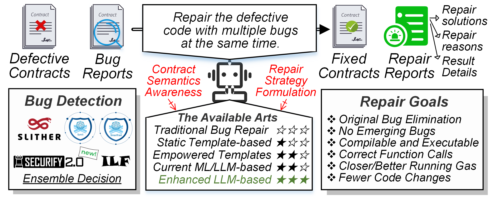

# AutoMender: LLM-based Smart Contract Bug Repair

AutoMender is an enhanced LLM framework for **automatically repairing smart contract bugs**. It combines retrieval-augmented generation (RAG), chain-of-thought (CoT) reasoning, **CMoE-LoRA** (Communicative Mixture-of-Experts with LoRA), PPO-based reinforcement learning, and multi-dimensional verification to deliver high-quality patches on real-world contracts.



> Each top-level folder of the repository corresponds to linked content in the manuscript.

---

## ✨ Highlights

- **Context-aware understanding + RAG** to ground the model in contract semantics and known bug/patch patterns.  
- **CMoE-LoRA**: per-bug-class LoRA experts with communication to reduce cross-class conflicts; easy to extend with new bug types.  
- **CoT + RL (PPO)**: reason through *identify → analyze → patch → review*, optimized end-to-end with a repair-quality reward.  
- **Holistic validation**: compilation/symbolic checks + multi-tool voting + gas/structure similarity to score fixes robustly.  
- **Real-world performance** on public datasets and mainnet “in-the-wild” contracts.

---

## 📦 Repository Structure

```
.
├── Bug\_examples/         # Curated bug definitions and patch suggestions (referenced by the paper)
├── Case/                 # Didactic, step-by-step cases (attack → root cause → fix)
├── Code/                 # Source code: RAG, CMoE-LoRA, CoT, RL, validators
├── Detection\_weights/    # Weights/configs for multi-detector voting
├── Security\_incidents/   # Public incident contracts used in evaluation
├── Wild\_instances/       # Real "in-the-wild" contracts and patch outcomes
├── Dataset1              # The contracts of Dataset1
````

---

## ⚡ Quick Start

### 1) Environment

- Python ≥ 3.10 (Linux recommended), optional CUDA GPU  
- Solidity compiler `solc` (multiple versions recommended)  
- Static/symbolic tools as needed by your configs (e.g., Slither)

```bash
pip install -r Code/requirements.txt
````

### 2) Data & Resources

* Place your target contracts in `Wild_instances/` (real samples) or `Security_incidents/` (public incidents).
* Choose or tweak detector weights in `Detection_weights/` (used by validators).

### 3) Minimal Run

```bash
# 1) Semantic extraction + retrieval
python Code/preprocess.py --src Wild_instances/demo.sol --out data/demo.json

# 2) Repair with CMoE-LoRA experts
python Code/repair.py \
  --input /mnt/data/demo.json \
  --experts reentrancy,arith \
  --patched /mnt/data/demo_patched.sol \
  --weights Detection_weights/default.yaml \
  --config Code/config/default.yaml

# 3) Validation and scoring
python Code/validate.py \
  --orig Wild_instances/demo.sol \
  --patched /mnt/data/demo_patched.sol \
  --weights Detection_weights/default.yaml \
  --report /mnt/data/report.json \
  --config Code/config/default.yaml
```

---

## 🧪 Examples

* **Bug exemplars**: `Bug_examples/`
* **Didactic cases**: `Case/`
* **Security incidents**: `Security_incidents/`
* **Mainnet contracts**: `Wild_instances/`

Each folder includes small notes or metadata to help you navigate.

---

## 📊 Metrics (Summary)

We evaluate fixes by: successful compilation/execution, **bug removal** (no residuals), **no newly introduced bugs**, **gas delta**, and **structural similarity**; these are aggregated into a composite quality score Ω. Ablations and full comparisons are detailed in the paper.

---

## 📁 Detector Weights

`Detection_weights/` contains example YAML/JSON configs for **multi-detector voting**. Adjust per bug class to balance precision/recall for your environment and detector set.

---

## 📖 Related Works


* Feist, J., *et al.* (2019). **Slither: A static analysis framework for smart contracts**. *WETSEB\@ICSE*, 8–15.
* Tsankov, P., *et al.* (2018). **Securify: Practical security analysis of smart contracts**. *ACM CCS*, 67–82.
* Rodler, M., Li, W., Karame, G. O., *et al.* (2021). **EVMPatch: Timely and automated patching of Ethereum smart contracts**. *USENIX Security*, 1289–1306.
* Jin, H., *et al.* (2021). **AROC: An automatic repair framework for on-chain smart contracts**. *IEEE TSE*.
* Torres, C. F., *et al.* (2021). **Elysium: Context-aware bytecode-level patching to automatically heal vulnerable smart contracts**. *RAID*, 115–128.
* Nguyen, T. D., *et al.* (2021). **SGUARD: Towards fixing vulnerable smart contracts automatically**. *IEEE S\&P*, 1215–1229.
* Gao, C., Yang, W., *et al.* (2024). **SGUARD+: ML-guided rule-based automated vulnerability repair on smart contracts**. *ACM TOSEM*, 33(5), 114:1–114:55.
* So, S., & Oh, H. (2023). **SmartFix: Fixing vulnerable smart contracts by accelerating generate-and-verify repair using statistical models**. *ESEC/FSE*, 185–197.
* Huang, R., *et al.* (2024). **ReenRepair: Automatic and semantic-equivalent repair of reentrancy in smart contracts**. *Journal of Systems and Software*, 216, 112107.
* Yu, X. L., Al-Bataineh, O. I., *et al.* (2020). **Smart contract repair**. *ACM TOSEM*, 29(4), 27:1–27:32.
* Wang, C., *et al.* (2024). **ContractTinker: LLM-empowered vulnerability repair for real-world smart contracts**. *ASE*, 2350–2353.
* Jain, A., Masud, E., *et al.* (2023). **Two Timin’: Repairing smart contracts with a two-layered approach**. *arXiv:2309.07841*.
* Lewis, P. S. H., *et al.* (2020). **Retrieval-Augmented Generation for knowledge-intensive NLP tasks**. *NeurIPS*.
* Wang, X., & Zhou, D. (2024). **Chain-of-Thought reasoning without prompting**. *NeurIPS*.
* Li, Z., Lu, S., Zhang, R., *et al.* (2023). **VulHunter: Hunting vulnerable smart contracts at EVM bytecode level via multiple-instance learning**. *IEEE TSE*, 49(11), 4886–4916.

---

## 📄 License

Unless otherwise stated, the code and data are for **academic research use only**. For commercial licensing or collaborations, please contact the authors.

---

## 🙏 Acknowledgments

We thank maintainers of `solc`, Slither, and other open-source analysis/verification tools, as well as public datasets and mainnet contract providers that enabled our evaluation.